# 4단계 시안 — 아직 넣지 않은 것들

집에서 이어서 볼 수 있게 정리한 문서. 사진은 전부 **실제 엔진 렌더**이고,
따로 명시하지 않는 한 **같은 자리(530 m 마지막 복도), 같은 프레임, 한 가지만
다르게** 찍은 것이다.

보는 법:

```
wine dist/SOUNDING.exe "-shot out.raw 420 40 -still -depth 530 -calm -proto N"
python3 tools/raw2png.py out.raw
```

`-proto 0`이 출시 빌드다. 530 m 복도가 `-proto 0`에서 **바이트 단위로
동일**(`430a2b02…`)하고 깊이 20 m 동굴 캡처도 그대로이므로, 아래 시안 중
**게임에 들어간 것은 없다**. 단 하나, 구역 배치만 예외다(바로 아래).

---

## 이미 넣은 것 — 구역 배치

`-proto` 밖으로 꺼내 실제 빌드에 들어갔다.

| 구역 | 처리 |
|---|---|
| 286–312 m | 폐허 |
| 336–354 m | 초록 관 |
| 398–436 m | 폐허 |
| 462–480 m | 초록 관 |
| 나머지 · 마지막 복도 | 멀쩡한 병동 |

양끝 5 m가 부드럽게 섞여 **걸어 들어가게** 된다. 전체를 폐허로 두면 그냥
폐허 병원이고, 문 하나 지나서 20년이 지나야 어긋남이 된다.

| 초록 구역 (345 m) | 폐허 구역 (300 m) | 멀쩡한 복도 (530 m) |
|---|---|---|
|  |  |  |

초록 구역 사진에서 **문 너머 다음 방이 아직 하얀 것**이 핵심이다. 그 경계가
전부다.

---

## 기준선


지금의 마지막 복도. 아래 사진은 전부 이 프레임에서 한 가지만 바꾼 것이다.

---

## 1차 — 어긋남 20개

익숙한 병원, 익숙한 물건. 크기·위치·개수·색·형태 가운데 **하나만** 틀어서
거부감을 만든다. `[벽]`은 알베도만 건드려 충돌과 무관하고 `mazecheck` 재실행이
필요 없다. `[필드]`는 C와 셰이더 양쪽 거리장을 같이 고쳐야 하고 넣은 뒤 반드시
미로 통과를 다시 검증해야 한다.

### 크기 — 맞는 물건, 틀린 치수

**SC-1 자라난 문** `[벽]`
평범한 병실 문인데 높이가 3.4 m. 유리창도 킥플레이트도 같이 커져서 비율은
완벽하고, 손잡이만 2.1 m에 있어 닿지 않는다.
→ 비율이 맞으니 착시가 아니라 *내가 작아진 것*으로 읽힌다. 혼수상태 화자에게
딱 맞는 감각.

**SC-2 내려앉은 천장** `[필드]`
한 베이만 천장이 1.55 m. 타일도 조명도 그대로인데 고개를 숙이고 지나가야 하고,
나오면 다시 정상.
→ 몸으로 느끼는 유일한 안. 침대에 눌려 있는 감각과 직결된다.

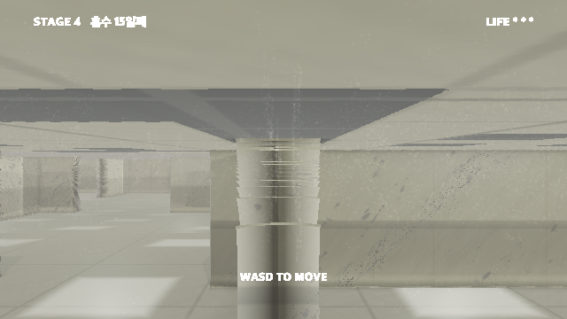

**SC-3 소아병동 문** `[벽]`
높이 1.15 m짜리 문. 유리창, 킥플레이트, 명패까지 그 크기에 맞게 정확히
축소돼 있다. 열 수는 없다.
→ SC-1의 반대. 둘을 같은 복도에 놓으면 "치수가 흔들리는 건물"이 된다.

**SC-4 끝이 안 보이는 복도** `[필드]`
일반 베이의 다섯 배 길이인 복도 한 줄. 문이 하나도 없고 조명만 일정 간격으로
계속된다.
→ 병원 복도는 문 때문에 존재한다. 문 없는 복도는 목적 없는 복도이고, 그게
"어디로도 이어지지 않는 통로"다.

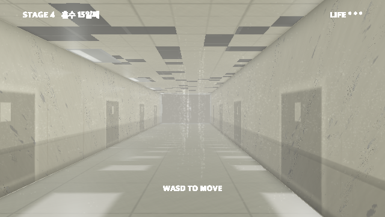

| SC-1 자라난 문 | SC-3 소아병동 문 |
|---|---|
|  |  |

> **찍어보고 안 것:** SC-1은 밝은 복도에서 **약하다**. 문이 벽보다 살짝 어두운
> 정도라 3.4 m가 돼도 실루엣이 안 산다. 넣으려면 문을 더 진하게 하거나 어두운
> 구역에 둬야 한다. 반대로 SC-3은 잘 읽힌다 — 크기가 *작아지면* 눈이 바로 잡는다.

### 위치 — 맞는 물건, 틀린 자리

**PL-1 천장의 문** `[벽]`
천장 타일 사이에 병실 문 하나가 온전히 박혀 있다. 손잡이, 경첩, 유리창까지
전부. 방향만 90도 틀렸다.
→ 레퍼런스가 "알고리즘 오류처럼 보이는 것"으로 꼽는 전형. 설명이 없어야 작동한다.

**PL-2 2 m 높이의 문** `[벽]`
빈 벽 2 m 지점에 정상 크기의 문. 계단도, 발판도, 난간도 없다. 누군가 쓰라고
만든 문인데 쓸 수가 없다.
→ 사용을 전제한 물건에서 사용 가능성만 빼앗는 방식. 위층이 있었다가 사라진
것처럼 읽힌다.

**PL-3 바닥에서 자란 침대** `[필드]`
병상 절반이 바닥 타일 밖으로 솟아 있다. 시트가 장판과 이어져 있고, 어디까지가
침대이고 어디부터가 바닥인지 경계가 없다.
→ 레퍼런스의 "고체와 융합된 가구". 그리고 이 게임에서는 *당신이 누워 있는 그
침대*라서 한 겹 더 간다.

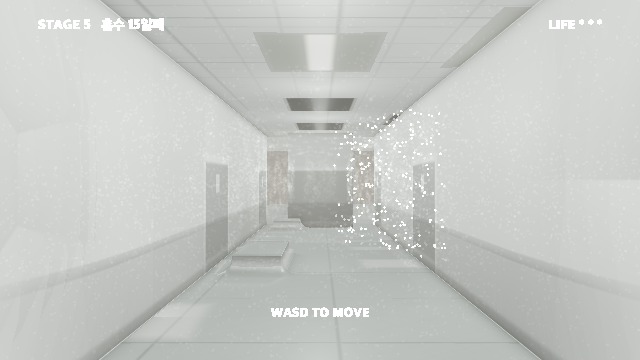

**PL-4 벽이 된 복도** `[필드]`
조명, 핸드레일, 다도, 양쪽 문까지 완전히 갖춘 복도가 20 m 가다가 아무 표시
없이 민벽으로 끝난다.
→ 되돌아 나와야 한다는 걸 아는 순간이 이 층에서 가장 답답한 순간이 된다.
랜드마크로도 강력하다.


**PL-5 뒤집힌 병실** `[벽]`
한 베이만 위아래가 바뀌어 있다. 조명기구가 바닥에 박혀 위를 비추고, 장판
타일이 머리 위에 있다. 걷는 데는 지장이 없다.
→ "돌려 눕힐게요"로 세계를 굴린 연출과 같은 계열이라 이야기와 붙는다 — 이 방은
굴린 채로 굳은 방이다.

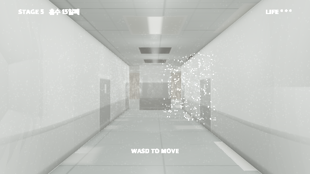

| PL-1 천장의 문 | PL-2 2 m 높이의 문 |
|---|---|
|  |  |

### 개수 — 맞는 물건, 틀린 수량

**CT-1 문만 있는 벽** `[벽]`
한쪽 벽에 똑같은 병실 문 열한 개가 40 cm 간격으로 붙어 있다. 전부 닫혀 있고
전부 같다.
→ 문 하나는 방 하나를 뜻한다. 40 cm 간격이면 뒤에 방이 있을 수가 없다. 산수가
안 맞는 게 보인다.

**CT-2 아까 그 방** `[벽]` ※ 밸런스 주의
어딘가 표시가 있는 베이 하나 — 벽의 긁힌 자국, 죽은 등 한 개 — 가 세 베이 뒤에
완전히 똑같이 다시 나온다.
→ 랜드마크를 줬다가 배신하는 안. 지도를 만들려는 시도 자체를 무너뜨린다.
*남용하면 짜증이 되니 한 쌍만.*

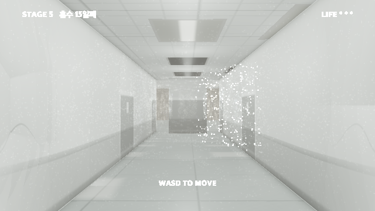

**CT-3 끝없는 대기 의자** `[필드]`
복도 한쪽 벽을 따라 대기실 의자가 끝까지 이어진다. 수백 개, 전부 비어 있고,
전부 같은 방향을 본다.
→ 리미널의 정의 그 자체 — 사람을 전제로 만든 것이 사람 없이 놓여 있는 것.
(→ 사물 목록의 **O-1**과 같은 물건. 사진 있음)

**CT-4 여덟 개의 EXIT** `[벽]` ※ 힌트와 상충
한 베이 천장에 초록 비상구 표지가 여덟 개, 전부 다른 방향을 가리킨다.
→ 이 게임에서 초록은 오직 출구 색이다. 여덟 번 반복하면 색의 의미가 무너진다.
*다만 유일한 힌트를 훼손하니 뒤쪽 한 곳에만.*

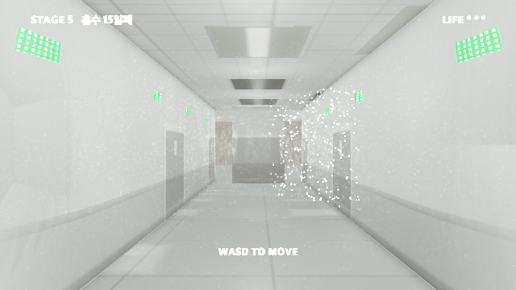


### 색 — 맞는 물건, 틀린 색

**CL-1 초록 병실** `[벽]` — **넣음 (336–354 m, 462–480 m)**
베이 하나만 조명이 초록. 기구도 천장도 똑같고 관 색만 다르다. 아무도 설명하지
않는다.
→ 실제 병원에서 등 색이 한 칸만 다른 일은 흔하다 — 그래서 더 걸린다. 있을
법한데 틀렸다.

**CL-2 붉은 다도** `[벽]`
복도 한 구간에서만 허리 높이 다도 띠가 마른 피 색이다. 칠은 깨끗하고 균일하다.
→ 얼룩이 아니라 *칠*이라는 게 핵심이다. 누군가 의도적으로 그 색을 골라
칠했다는 뜻이 되니까.

**CL-3 무너지는 구역** `[벽]` — **넣음 (286–312 m, 398–436 m)**
한 구역 전체가 20년 더 늙어 있다. 천장에서 물이 들어와 벽을 타고 내려오고,
물이 지나간 자리부터 페인트가 떨어져 회색 미장이 드러나고, 회벽이 자기
응력선을 따라 갈라진다. 천장 타일은 그리드에 얹혀만 있어서 제일 먼저 떨어지고,
뚫린 자리로 배관이 보인다.
→ 같은 건물의 다른 시간. 복도 하나 건넜을 뿐인데 20년이 지나 있는 건 꿈에서만
되는 일이다.

| CL-1 초록 병실 | CL-2 붉은 다도 | CL-3 무너지는 구역 |
|---|---|---|
|  |  |  |

> **CL-3 만들면서 안 것:** 손상을 벽 전면에 깔면 손상이 아니라 **화강암 무늬**가
> 된다. 저주파 마스크를 곱해 얼룩덜룩하게 만들어야 건물이 *구역별로* 망가진
> 것으로 읽힌다. 천장 뚫린 자리에는 배관을 한 줄 넣어야 검은 사각형이 아니라
> **구멍**이 된다.

### 형태 · 빛

**~~FM-1 손잡이 없는 문~~ — 목록에서 뺌**
유리창도 킥플레이트도 명패도 전부 있는데 손잡이만 없는 문을 만들려 했는데,
**지금 문에 손잡이가 원래 없다.** 그리려던 걸 이미 하고 있었다.

**FM-2 벽을 보는 창** `[벽]`
프레임, 창틀, 블라인드까지 제대로 갖춘 창문. 유리 20 cm 뒤는 콘크리트 벽이다.
→ 이 층에 창문이 하나도 없다는 걸 그제야 깨닫게 만드는 장치이기도 하다.
바깥이 없는 건물.

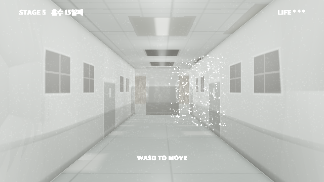

**FM-4 비치지 않는 거울** `[평면 반사 필요]`
벽에 걸린 병동 거울. 맞은편 복도와 천장 조명은 정확히 비치는데 플레이어만 없다.
→ 이 게임 전체에서 가장 직접적인 한 줄 — *당신은 여기 없습니다.*

> **이것만 그림이 없다.** 1인칭이라 화면에 플레이어 모델이 없고, 정지 화면은
> "비쳐야 할 것이 안 비친다"를 보여줄 수가 없다. 평면 반사를 실제로 넣고
> 움직여봐야 판단이 되는 유일한 안이다.

**LT-1 깜빡이는 하나** `[벽]` ※ 가장 쌈
모든 조명이 심장 박동에 맞춰 고요히 부푸는 동안, 딱 하나만 불규칙하게 깜빡인다.
그리고 그건 당신이 자꾸 돌아오게 되는 교차로의 등이다.
→ 이미 있는 맥박 조명 시스템을 배신하는 방식이라 추가 비용이 거의 없고,
랜드마크 기능이 가장 확실하다.


## 2차 — 병동 10개

각각 한 구역(25–40 m). 지금 구조(7 m 그리드, 다도, 천장 그리드)를 그대로 쓰고
마감과 소품만 바꾼다.

**W-1 소아병동** `[벽]`
모든 것이 한 뼘씩 낮다. 핸드레일이 60 cm, 문손잡이가 80 cm, 다도 대신 1 m
높이에 바랜 동물 띠지. 의자도 작다.
→ 치수가 전부 맞는데 *나에게만* 안 맞는다. SC 계열의 크기 어긋남을 방 하나가
아니라 구역 전체로 하는 방식.

**W-2 격리병동** `[필드]`
문마다 비닐 커튼과 이중문. 벽에 음압 표시등, 바닥에 노란 경계선, 입구마다
가운·장갑 걸이. 전부 사용된 흔적 없이 새것이다.
→ 격리는 "안에 뭔가 있다"는 뜻이다. 아무도 없는 격리병동은 그 뭔가가 어디
갔는지를 묻게 만든다.

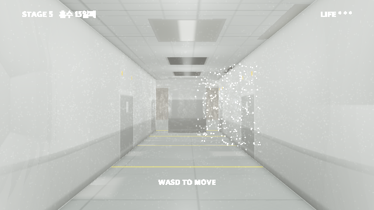

**W-3 폐쇄병동** `[벽]` ※ 주제 직결
안쪽에 손잡이가 없는 문, 문마다 작은 관찰창, 모서리가 전부 둥글고 벽은 완충재.
창은 격자 강화유리. 조명이 천장에 매립돼 만질 수 없다.
→ *나가지 못하게 설계된 공간.* 이 게임의 주제 그 자체라 한 구역이 아니라
마지막 구역에 두는 것도 방법이다.

**W-4 수술부** `[벽]`
바닥부터 천장까지 청록 타일, 스크럽 싱크가 벽을 따라 늘어서고, 문 위에 빨간
`사용중` 표시등. 자동문은 열리지 않는다.
→ 이 층에서 유일하게 색이 다른 구역이 된다. 빨간 표시등은 초록 비상구 다음으로
강한 채도 포인트.

**W-5 영안실** `[필드]` ※ 주제 직결
천장까지 타일, 바닥 한가운데 배수구, 한쪽 벽 전체가 스테인리스 서랍. 다른 어느
구역보다 춥게 — 푸른 쪽으로 밀린 조명.
→ 코마 환자가 헤매다 도착할 수 있는 가장 나쁜 방. 아무 설명 없이 지나가게만
두면 된다.

**W-6 신생아실** `[필드]`
복도 한쪽이 통유리이고 그 너머에 빈 아기침대가 줄지어 있다. 온열등만 켜져 있고
유리는 들어갈 수 없다.
→ 볼 수는 있는데 갈 수는 없는 방. 리미널의 "사람을 전제로 만든 것이 비어
있음"이 가장 잔인하게 나오는 형태.

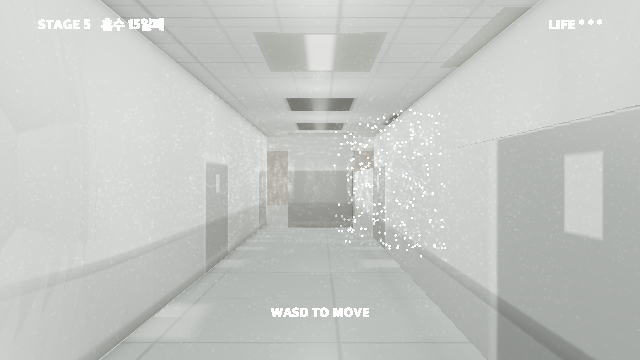

**W-7 재활치료실** `[평면 반사]`
평행봉, 매트, 한쪽 벽 전체가 거울. 천장이 다른 데보다 높고 조명이 밝다.
→ 거울 벽 하나로 FM-4(비치지 않는 거울)를 구역 규모로 쓸 수 있다. 그리고
재활은 *깨어난 다음*의 공간이다.

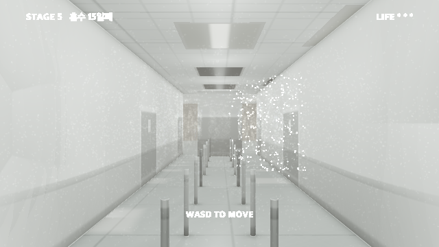

**W-8 외래 대기** `[필드]`
연결 의자가 줄줄이, 벽에 번호 표시기, 접수 카운터. 표시기는 꺼져 있거나 한
숫자에 멈춰 있다.
→ 이 층에서 가장 "기다림"인 공간. 멈춘 번호 하나가 시계보다 세다.

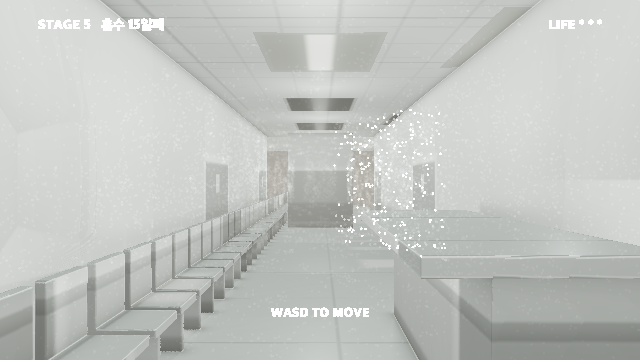

**W-9 영상의학과** `[필드]` ※ 대사와 연결
두꺼운 납문, 방사선 삼엽 표시, 벽이 눈에 띄게 두껍고, 조작실 쪽으로 난 작은
관찰창. 안에 촬영대만 있다.
→ "검사실 다녀오겠습니다" 대사와 직접 붙는다. 복도가 늘어나는 그 연출이
도착하는 곳이 여기면 된다.

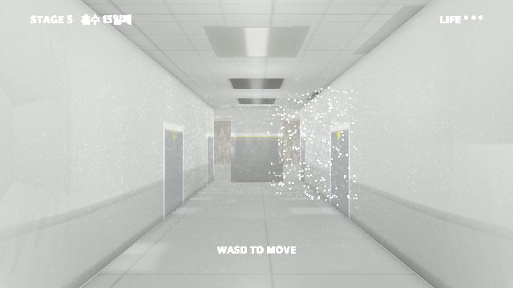

**W-10 기계실** `[필드]`
마감이 아예 없다. 콘크리트, 노출 배관, 덕트, 케이블 트레이, 비상등만.
병원의 안쪽.
→ 폐허 구역과 다르다 — 망가진 게 아니라 *원래 안 보여주는 곳*이다. 무대 뒤로
넘어간 감각.

| W-4 수술부 | W-5 영안실 |
|---|---|
|  |  |

| W-3 폐쇄병동 | W-1 소아병동 | W-10 기계실 |
|---|---|---|
|  |  |  |

> **찍어보고 안 것:** W-4와 W-5는 마감만 바꿨는데 완전히 다른 건물이 된다.
> 반대로 **W-3은 렌더가 약하다** — 누빔과 관찰창이 이 밝기에서 잘 안 보인다.
> 주제상 제일 중요한 안인데 그림이 못 받쳐주니, 넣으려면 벽 색을 확실히 바꾸고
> 관찰창을 키워야 한다. **W-1도 마찬가지** — 낮아진 핸드레일만으로는 부족하고
> 문 높이까지 같이 낮춰야 "치수가 나에게만 안 맞는다"가 성립한다.

---

## 2차 — 사물 20개

지금 4단계 270 m 안에 **사물이 0개**다. 랜드마크가 없어서 길찾기가 어려운 게
아니라 *임의적*이다.

### 벽에 붙는 것 — 충돌과 무관, `mazecheck` 재실행 불필요

**O-9 손소독제** — 문 옆마다 벽에 붙은 펌프, 일정 간격으로 반복.
→ 가장 값싼 안. 벽 좌표만으로 그려지고 복도에 리듬을 준다.

**O-10 소화기함** — 벽에 매입된 빨간 캐비닛, 유리 앞판, 일정 간격.
→ 빨강 하나가 이 회녹색 세계에서 크게 읽힌다. 비상구 초록과 짝이 된다.

**O-11 병실 명패** — 문마다 옆에 작은 명패. 호실 번호가 있고 이름 자리는 비어 있다.
→ **호실 번호가 있으면 길찾기가 가능해진다.** 기괴함과 랜드마크를 동시에 주는
유일한 안. 번호가 순서대로가 아니면 더 좋다.

**O-12 안내 게시판** — 코르크판에 종이 몇 장. 글자는 읽히지 않는 크기이고 한
장은 떨어져 압정 하나에 매달려 있다.
→ 읽히지 않는 게 중요하다. 읽으려고 다가가게 만들고, 다가가면 아무것도 없다.

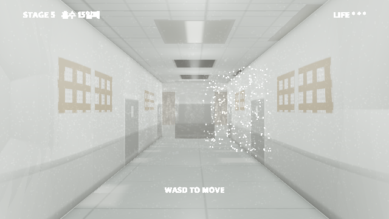

**O-13 멈춘 벽시계** — 문과 문 사이에 하나씩, 전부 같은 시각에 멈춰 있다.
→ 한 번 실패했다가 **고쳤다.** 벽을 따라가는 임의의 mod 대신 문 중심에서 잰
거리(명패와 같은 방식)를 쓰니 반드시 보이는 벽에 앉는다.

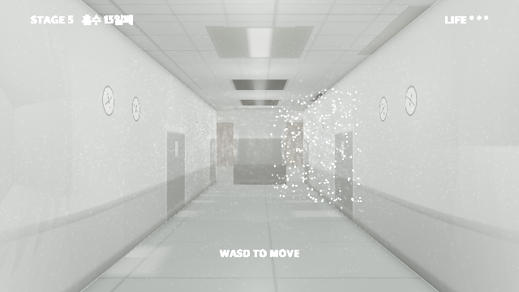

**O-14 산소 배관구** — 병상 머리맡 헤드월에 산소·흡인·전원 포트가 한 줄, 캡이
씌워져 있다.
→ 엔딩 병실에 이미 있는 물건. O-4와 함께 복선을 회수한다 — *내가 지금 누워
있는 벽.*

**O-15 커튼 트랙** — 천장에 곡선 트랙, 커튼은 한쪽으로 몰려 걷혀 있다. 어떤
칸은 커튼 없이 트랙만 남았다.
→ 커튼 없는 트랙이 커튼 있는 트랙보다 세다. 치워졌다는 뜻이니까.

**O-20 비상 손전등 거치대** — 벽에 붙은 충전 거치대, 손전등이 꽂혀 초록
충전등이 깜빡인다. 빼서 쓸 수는 없다.
→ 소리로 보던 사람이 *빛*을 눈앞에 두고 못 쓰는 것 — 이 게임에서만 성립하는
잔인함.

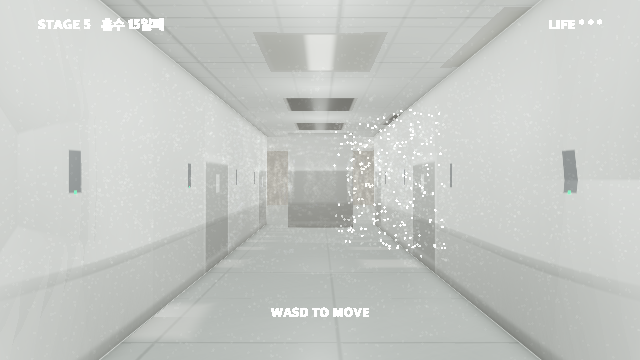

| O-11 명패 | O-9 · O-10 · O-14 벽 설비 |
|---|---|
|  |  |

### 바닥에 서는 것 — 두 거리장 모두 수정 + `mazecheck` 재실행 필수

**O-1 연결 대기 의자** — 3인 연결 의자를 벽에 붙여. 좌판은 낡은 청록 비닐,
다리는 크롬. 복도 끝까지 이어진다.
→ 리미널 사진에서 가장 자주 등장하는 물건. 빈 의자 한 줄이 사람 없음을 가장
크게 말한다. (= CT-3)

**O-2 빈 병상** — 시트가 각 잡혀 정돈된 침대 하나. 난간은 올려져 있고 베개에
눌린 자국만 남아 있다.
→ 눌린 자국 하나가 "방금까지 누가 있었다"를 만든다. 그리고 그건 *당신 침대*일
수도 있다.

**O-3 세워둔 이송침대** — 벽에 바짝 붙여 세워둔 스트레처. 시트 없이 매트리스만,
안전벨트가 늘어져 있다.
→ 복도에 물건이 나와 있다는 것 자체가 "쓰는 중인 병원"을 뜻한다. 그런데
아무도 없다.

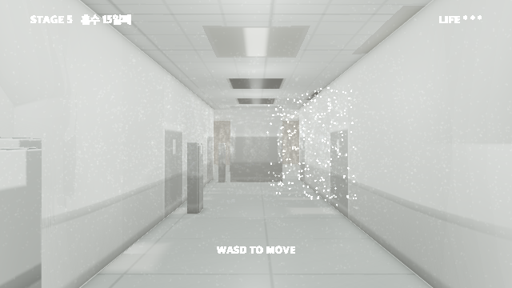

**O-4 링거대** — 수액백이 매달린 폴대. 라인이 바닥까지 늘어져 있고 끝은 아무
데도 연결돼 있지 않다.
→ 엔딩 병실에 이미 있는 물건이라 *여기서 본 것을 저기서 다시 본다*가 성립한다.

**O-5 휠체어** — 복도 한가운데를 향해 돌려진 채 놓인 휠체어. 브레이크가 걸려
있다.
→ 방향이 정보다. 벽을 보고 있으면 그냥 치워둔 것이고, 복도를 향하면 누가
앉아 있었다는 뜻이다.

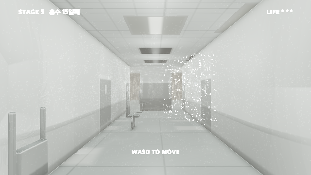

**O-6 처치 카트** — 서랍 달린 스테인리스 카트, 위에 트레이와 거즈, 잠기지 않은
서랍 한 칸이 열려 있다.
→ 열린 서랍 하나가 "중간에 멈췄다"를 만든다.

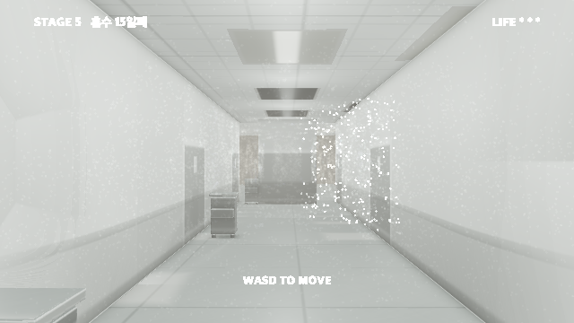

**O-7 린넨 카트** — 천 카트에 수건과 시트가 쌓여 있다.
→ 전부 단단한 면인 공간에서 부드러운 덩어리 하나가 눈에 띈다. 대비용.

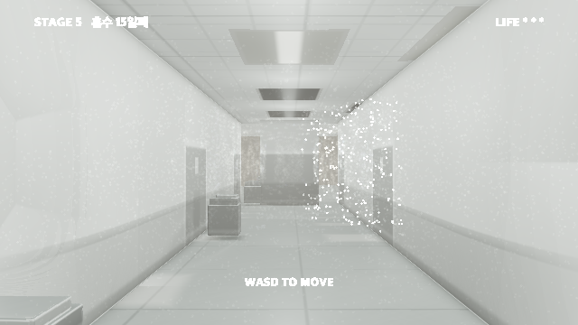

**O-8 청소 카트와 대걸레** — 양동이에 대걸레가 꽂힌 채, 바닥에 노란 `미끄럼 주의`
접이 표지판이 함께.
→ 표지판은 *사람에게 하는 경고*다. 볼 사람이 없는 경고문이 이 층 전체를
요약한다.

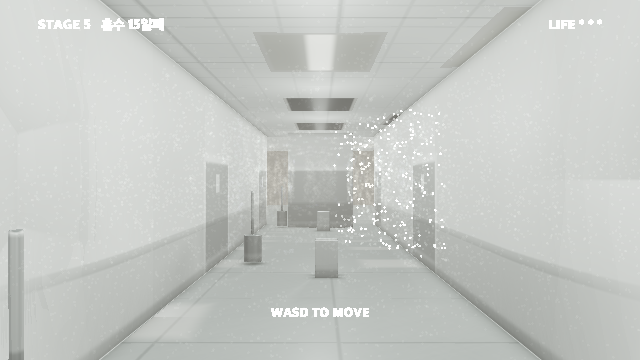

**O-16 의료폐기물 통** — 노란 통, 생물학적 위험 표시. 뚜껑이 닫혀 있고 가득 차
있다.
→ 노랑은 이 층에 없는 색이다. 그리고 가득 찼다는 건 *누가 쓰긴 썼다*는 뜻이다.

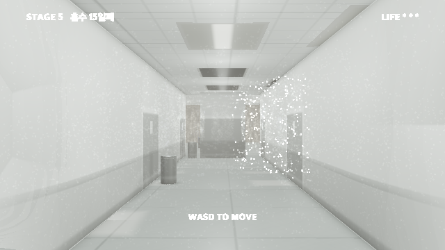

**O-17 정수기** — 복도 끝에 정수기와 종이컵 통. 컵 통은 비어 있다.
→ 복도 끝에 뭔가 있으면 거기까지 걸어가게 된다. 길찾기 미끼로 쓸 수 있다.

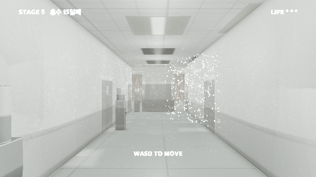

**O-18 보호자 간이침대** ※ 주제 직결 — 병상 옆에 접이식 간이침대. 담요가 개어져
있고 그 위에 책이 엎어져 있다.
→ 이 게임 전체에서 가장 슬픈 물건이다. 보름 동안 누가 여기서 잤다는 뜻이니까.
병실 대사와 직접 붙는다.

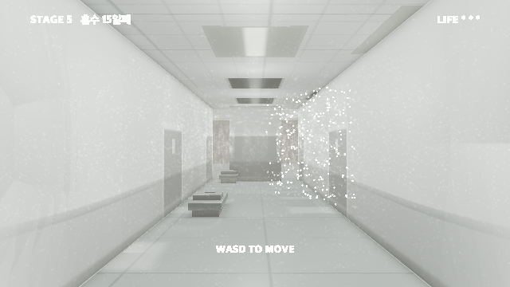

**O-19 이동형 X선 장비** ※ 통로 폭 주의 — 복도를 막다시피 세워둔 큰 장비. 암이
접혀 있고 전선이 감겨 있다.
→ 크고 복도를 좁혀서 *지나가는 경험*을 만든다. 랜드마크로도 강하다.

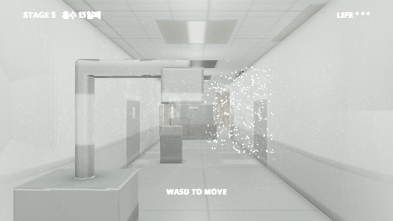

| O-1 끝없는 의자 | O-2 빈 병상 | O-4 · O-5 링거대와 휠체어 |
|---|---|---|
|  |  |  |

> **찍어보고 바뀐 판단:** 처음에는 O-11 명패를 1순위로 꼽았는데, 실제로
> 그려보니 **O-1 의자 쪽이 훨씬 세다.** 복도 끝까지 이어지는 빈 의자 줄 하나가
> 지금까지 이 게임이 만든 이미지 중 가장 리미널하다.
>
> **주의:** 바닥에 서는 것들은 지금 **셰이더 필드에만** 들어 있어 **통과해서
> 걸어진다.** 채택 전에는 그게 맞는 거래다 — 아무도 안 고른 걸 두 거리장에
> 다 넣고 미로 검증까지 다시 돌리는 건 낭비니까. 채택하면 `cave_sdf`에도 넣고
> `mazecheck`를 다시 돌린다. 복도의 의자는 **갇힐 수 있는 의자**다.

---

## 측정된 미로 상태

| 항목 | 값 |
|---|---|
| 직선 거리 | 300 m |
| 실제 최단 경로 | 405 m (12시드 평균) |
| 우회율 | 1.35× (1.17–1.50) |
| 현재 사물 수 | 0 |

미로 자체는 어렵지 않다. 어려운 건 방향 감각인데 랜드마크가 0이라 지도를
머릿속에 만들 수가 없다. **기괴한 사물은 그 자체로 랜드마크**이므로 위
시안들이 두 문제를 동시에 푼다.

---

## `-proto` 번호표

| N | 시안 |
|---|---|
| 0 | 출시 빌드 (기준선) |
| 1 | PL-1 천장의 문 |
| 2 | CT-1 문만 있는 벽 |
| 3 | CL-1 초록 병실 |
| 4 | CL-2 붉은 다도 |
| 5 | SC-1 자라난 문 |
| 6 | SC-3 소아병동 문 |
| 7 | PL-2 2 m 높이의 문 |
| 8 | CL-3 무너지는 구역 |
| 10 | O-11 명패 |
| 11 | O-9 · O-10 · O-14 벽 설비 |
| 12 | O-1 연결 대기 의자 |
| 13 | O-2 빈 병상 |
| 14 | O-4 링거대 · O-5 휠체어 |
| 15 | W-3 폐쇄병동 |
| 16 | W-4 수술부 |
| 17 | W-5 영안실 |
| 18 | W-1 소아병동 |
| 19 | W-10 기계실 |
| 20 | O-13 멈춘 벽시계 |
| 21 | O-6 처치 카트 |
| 22 | O-7 린넨 카트 |
| 23 | O-8 청소 카트 |
| 24 | O-3 세워둔 이송침대 |
| 25 | O-5 휠체어 |
| 26 | O-12 안내 게시판 |
| 28 | O-16 의료폐기물 통 |
| 29 | O-17 정수기 |
| 30 | O-18 보호자 간이침대 |
| 31 | O-19 이동형 X선 |
| 32 | O-20 손전등 거치대 |
| 33 | SC-2 내려앉은 천장 |
| 34 | SC-4 끝이 안 보이는 복도 |
| 35 | PL-3 바닥에서 자란 침대 |
| 36 | PL-4 벽이 된 복도 |
| 37 | PL-5 뒤집힌 병실 |
| 38 | CT-2 아까 그 방 |
| 39 | CT-4 여덟 개의 EXIT |
| 40 | FM-2 벽을 보는 창 |
| 42 | LT-1 깜빡이는 하나 |
| 43 | W-2 격리병동 |
| 44 | W-6 신생아실 |
| 45 | W-7 재활치료실 |
| 46 | W-8 외래 대기 |
| 47 | W-9 영상의학과 |

---

## 추천

마감이 **9월 4일 23:39**이므로 값싼 것부터.

1. **O-1 연결 대기 의자** — 그림이 제일 세다. 단 두 거리장 + `mazecheck` 필요
2. **O-11 명패** — 길찾기가 같이 좋아지는 유일한 안. 벽에만 붙어 안전
3. **O-9 · O-10 · O-14** — 값싸고 복도에 리듬
4. **W-4 수술부** 또는 **W-5 영안실** — 마감만 바꿔 구역 하나가 완전히 달라진다
5. **LT-1 깜빡이는 등 하나** — 이미 있는 맥박 조명을 배신하는 방식이라 거의 공짜

병동은 **W-3 폐쇄병동** 하나만 골라도 주제가 크게 강해진다. 다만 위에 적었듯
지금 렌더는 약하니 벽 색과 관찰창을 손봐야 한다.
