# 4단계 시안 — 아직 넣지 않은 것들

집에서 이어서 볼 수 있게 정리한 문서. 사진은 전부 **실제 엔진 렌더**이고,
따로 명시하지 않는 한 **같은 자리(530 m 마지막 복도), 같은 프레임, 한 가지만
다르게** 찍은 것이다.

보는 법:

```
wine dist/SOUNDING.exe "-shot out.raw 420 40 -still -depth 530 -calm -proto N"
python3 tools/raw2png.py out.raw
```

`-proto 0`이 출시 빌드다. 530 m 복도가 `-proto 0`에서 **바이트 단위로
동일**(`430a2b02…`)하고 깊이 20 m 동굴 캡처도 그대로이므로, 아래 시안 중
**게임에 들어간 것은 없다**. 단 하나, 구역 배치만 예외다(바로 아래).

---

## 이미 넣은 것 — 구역 배치

`-proto` 밖으로 꺼내 실제 빌드에 들어갔다.

| 구역 | 처리 |
|---|---|
| 286–312 m | 폐허 |
| 336–354 m | 초록 관 |
| 398–436 m | 폐허 |
| 462–480 m | 초록 관 |
| 나머지 · 마지막 복도 | 멀쩡한 병동 |

양끝 5 m가 부드럽게 섞여 **걸어 들어가게** 된다. 전체를 폐허로 두면 그냥
폐허 병원이고, 문 하나 지나서 20년이 지나야 어긋남이 된다.

| 초록 구역 (345 m) | 폐허 구역 (300 m) | 멀쩡한 복도 (530 m) |
|---|---|---|
| 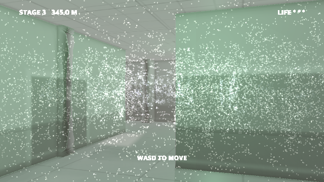 | 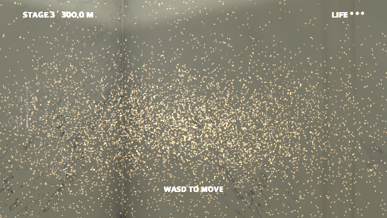 |  |

초록 구역 사진에서 **문 너머 다음 방이 아직 하얀 것**이 핵심이다. 그 경계가
전부다.

---

## 기준선


지금의 마지막 복도. 아래 사진은 전부 이 프레임에서 한 가지만 바꾼 것이다.

---

## 1차 — 어긋남 20개

익숙한 병원, 익숙한 물건. 크기·위치·개수·색·형태 가운데 **하나만** 틀어서
거부감을 만든다.

### 크기

| 코드 | 이름 | 내용 |
|---|---|---|
| **SC-1** | 자라난 문 | 높이 3.4 m. 유리창·킥플레이트까지 같이 커져 비율은 완벽하고, 손잡이만 2.1 m라 닿지 않는다 |
| **SC-2** | 내려앉은 천장 | 한 베이만 천장이 1.55 m. 고개를 숙이고 지나가야 한다 |
| **SC-3** | 소아병동 문 | 높이 1.15 m. 부속이 전부 그 크기에 맞게 축소돼 있다 |
| **SC-4** | 끝이 안 보이는 복도 | 일반 베이의 5배 길이, 문이 하나도 없다 |

| SC-1 자라난 문 | SC-3 소아병동 문 |
|---|---|
| 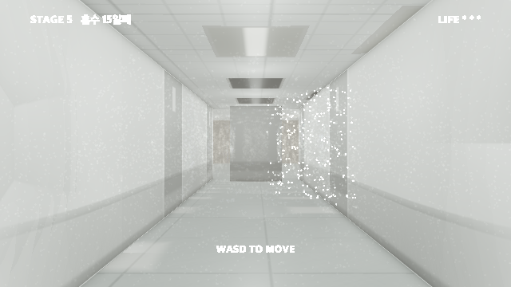 | 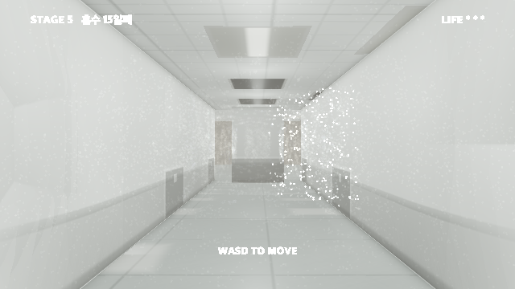 |

> **찍어보고 안 것:** SC-1은 밝은 복도에서 **약하다**. 문이 벽보다 살짝 어두운
> 정도라 3.4 m가 돼도 실루엣이 안 산다. 넣으려면 문을 더 진하게 하거나 어두운
> 구역에 둬야 한다. 반대로 SC-3은 잘 읽힌다 — 크기가 *작아지면* 눈이 바로 잡는다.

### 위치

| 코드 | 이름 | 내용 |
|---|---|---|
| **PL-1** | 천장의 문 | 병실 문이 천장에 온전히 박혀 있다. 손잡이·경첩·유리창까지 |
| **PL-2** | 2 m 높이의 문 | 빈 벽 2 m 지점. 계단도 발판도 없다 |
| **PL-3** | 바닥에서 자란 침대 | 병상 절반이 바닥 타일 밖으로 솟아 있고 시트가 장판과 이어진다 |
| **PL-4** | 벽이 된 복도 | 완전히 갖춘 복도가 20 m 가다 민벽으로 끝난다 |
| **PL-5** | 뒤집힌 병실 | 조명이 바닥에, 장판 타일이 머리 위에 |

| PL-1 천장의 문 | PL-2 2 m 높이의 문 |
|---|---|
| 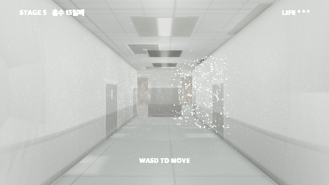 | 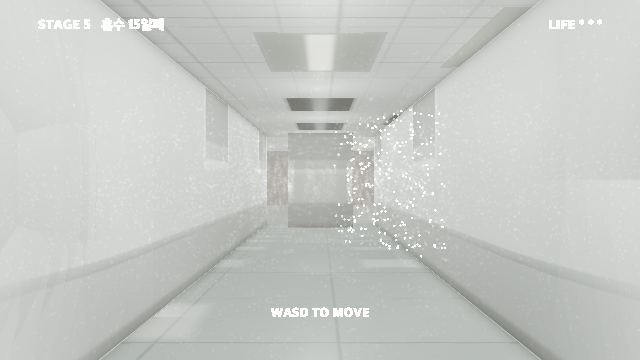 |

### 개수

| 코드 | 이름 | 내용 |
|---|---|---|
| **CT-1** | 문만 있는 벽 | 똑같은 문 11개가 40 cm 간격 |
| **CT-2** | 아까 그 방 | 표시가 있는 베이가 세 베이 뒤에 똑같이 다시 나온다 |
| **CT-3** | 끝없는 대기 의자 | 복도 끝까지 이어지는 빈 의자 |
| **CT-4** | 여덟 개의 EXIT | 한 베이에 비상구 표지 8개, 전부 다른 방향 ※ 유일한 힌트를 훼손 |

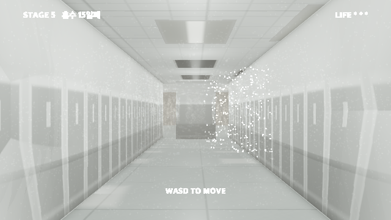

### 색

| 코드 | 이름 | 내용 |
|---|---|---|
| **CL-1** | 초록 병실 | 베이 하나만 관 색이 초록 — **넣음** |
| **CL-2** | 붉은 다도 | 허리 높이 띠가 마른 피 색. 얼룩이 아니라 *칠*이라는 게 핵심 |
| **CL-3** | 무너지는 구역 | 20년 늙은 구역 — **넣음** |

| CL-1 초록 병실 | CL-2 붉은 다도 | CL-3 무너지는 구역 |
|---|---|---|
| 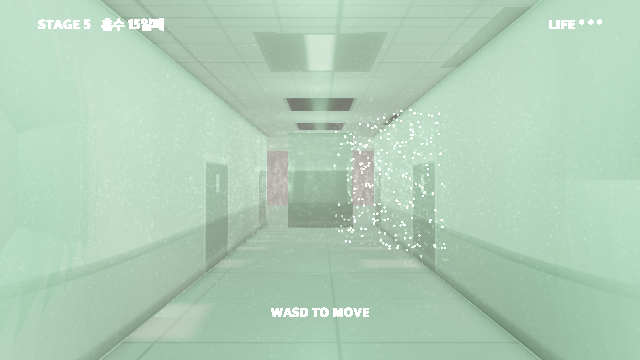 | 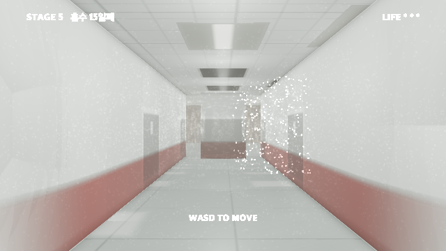 | 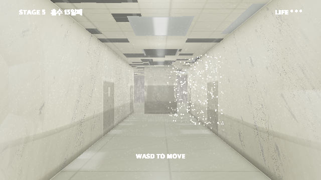 |

> **CL-3 만들면서 안 것:** 손상을 벽 전면에 깔면 손상이 아니라 **화강암 무늬**가
> 된다. 저주파 마스크를 곱해 얼룩덜룩하게 만들어야 건물이 *구역별로* 망가진
> 것으로 읽힌다. 천장 뚫린 자리에는 배관을 한 줄 넣어야 검은 사각형이 아니라
> **구멍**이 된다.

### 형태 · 빛

| 코드 | 이름 | 내용 |
|---|---|---|
| ~~FM-1~~ | ~~손잡이 없는 문~~ | **이미 그렇다.** 지금 문에 손잡이가 없다 — 목록에서 뺀다 |
| **FM-2** | 벽을 보는 창 | 제대로 된 창문, 유리 20 cm 뒤는 콘크리트 |
| **FM-4** | 비치지 않는 거울 | 복도와 조명은 비치는데 플레이어만 없다 |
| **LT-1** | 깜빡이는 하나 | 전부 맥박에 맞춰 부푸는데 딱 하나만 불규칙하게. 자꾸 돌아오게 되는 교차로의 등 |

---

## 2차 — 병동 10개

각각 한 구역(25–40 m). 지금 구조(7 m 그리드, 다도, 천장 그리드)를 그대로 쓰고
마감과 소품만 바꾼다.

| 코드 | 이름 | 왜 |
|---|---|---|
| **W-1** | 소아병동 | 치수가 전부 맞는데 *나에게만* 안 맞는다 |
| **W-2** | 격리병동 | 격리는 "안에 뭔가 있다"는 뜻. 비어 있으면 그게 어디 갔는지 묻게 된다 |
| **W-3** | 폐쇄병동 | **나가지 못하게 설계된 공간** — 이 게임의 주제 그 자체 |
| **W-4** | 수술부 | 문 위 빨간 표시등이 초록 비상구와 짝이 된다 |
| **W-5** | 영안실 | 코마 환자가 헤매다 도착할 수 있는 가장 나쁜 방 |
| **W-6** | 신생아실 | 볼 수는 있는데 갈 수는 없는 방 |
| **W-7** | 재활치료실 | 거울 벽으로 FM-4를 구역 규모로. 재활은 *깨어난 다음*의 공간 |
| **W-8** | 외래 대기 | 멈춘 번호표 하나가 시계보다 세다 |
| **W-9** | 영상의학과 | "검사실 다녀오겠습니다" 대사가 도착하는 곳 |
| **W-10** | 기계실 | 망가진 게 아니라 *원래 안 보여주는 곳*. 무대 뒤 |

| W-4 수술부 | W-5 영안실 |
|---|---|
| 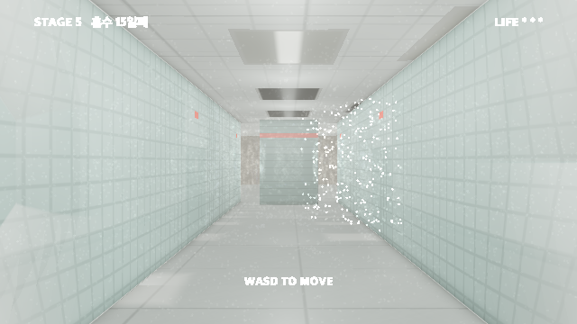 | 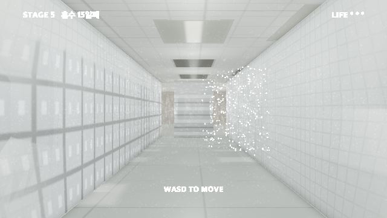 |

| W-3 폐쇄병동 | W-1 소아병동 | W-10 기계실 |
|---|---|---|
| 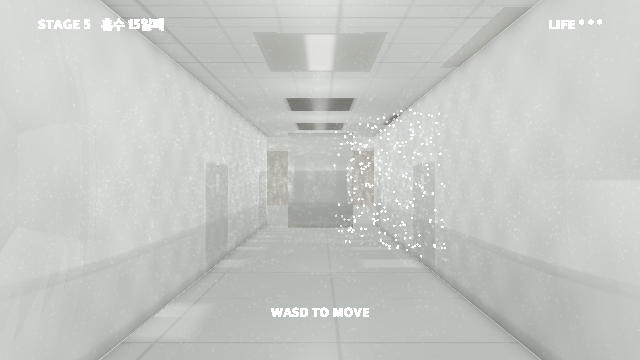 | 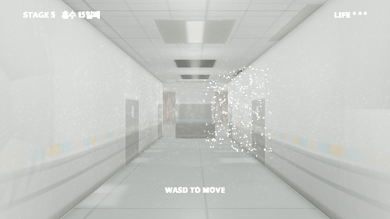 | 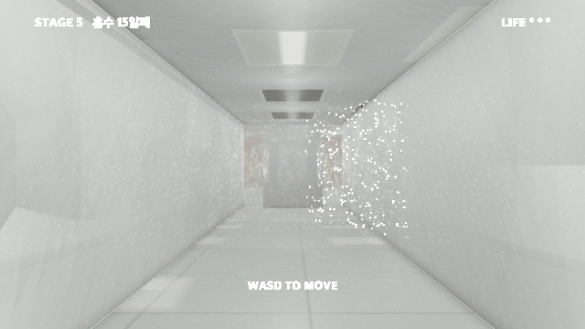 |

> **찍어보고 안 것:** W-4와 W-5는 마감만 바꿨는데 완전히 다른 건물이 된다.
> 반대로 **W-3은 렌더가 약하다** — 누빔과 관찰창이 이 밝기에서 잘 안 보인다.
> 주제상 제일 중요한 안인데 그림이 못 받쳐주니, 넣으려면 벽 색을 확실히 바꾸고
> 관찰창을 키워야 한다. **W-1도 마찬가지** — 낮아진 핸드레일만으로는 부족하고
> 문 높이까지 같이 낮춰야 "치수가 나에게만 안 맞는다"가 성립한다.

---

## 2차 — 사물 20개

지금 4단계 270 m 안에 **사물이 0개**다. 랜드마크가 없어서 길찾기가 어려운 게
아니라 *임의적*이다.

### 벽에 붙는 것 — 충돌 판정과 무관, `mazecheck` 재실행 불필요

| 코드 | 이름 | 메모 |
|---|---|---|
| **O-9** | 손소독제 | 문 옆마다. 가장 값싸고 복도에 리듬을 준다 |
| **O-10** | 소화기함 | 빨강 하나가 회녹색 세계에서 크게 읽힌다 |
| **O-11** | 병실 명패 | **기괴함과 길찾기를 동시에 주는 유일한 안.** 번호가 순서대로가 아니면 더 좋다 |
| **O-12** | 안내 게시판 | 읽히지 않는 게 중요하다. 다가가게 만들고 다가가면 아무것도 없다 |
| **O-13** | 멈춘 벽시계 | 전에 한 번 실패 — 배치를 O-11 방식(셀 중심 기준)으로 하면 해결 |
| **O-14** | 산소 배관구 | 엔딩 병실에 이미 있는 물건. 복선 회수 |
| **O-15** | 커튼 트랙 | 커튼 없는 트랙이 있는 트랙보다 세다. 치워졌다는 뜻이니까 |
| **O-20** | 비상 손전등 거치대 | 소리로 보던 사람이 *빛*을 눈앞에 두고 못 쓴다 |

| O-11 명패 | O-9 · O-10 · O-14 벽 설비 |
|---|---|
| 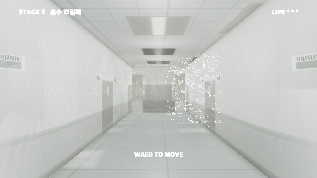 | 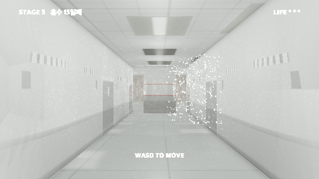 |

### 바닥에 서는 것 — 두 거리장 모두 수정 + `mazecheck` 재실행 필수

| 코드 | 이름 | 메모 |
|---|---|---|
| **O-1** | 연결 대기 의자 | 사람을 앉히려고 만든 물건이 끝없이 비어 있다 |
| **O-2** | 빈 병상 | 베개에 눌린 자국 하나가 "방금까지 누가 있었다"를 만든다 |
| **O-3** | 세워둔 이송침대 | 복도에 물건이 나와 있다 = 쓰는 중인 병원. 그런데 아무도 없다 |
| **O-4** | 링거대 | 엔딩 병실과 같은 물건 |
| **O-5** | 휠체어 | 방향이 정보다. 복도를 향하면 누가 앉아 있었다는 뜻 |
| **O-6** | 처치 카트 | 열린 서랍 하나가 "중간에 멈췄다"를 만든다 |
| **O-7** | 린넨 카트 | 전부 단단한 면인 공간에서 유일하게 부드러운 덩어리 |
| **O-8** | 청소 카트 | 미끄럼 주의 표지판 — *볼 사람이 없는 경고문* |
| **O-16** | 의료폐기물 통 | 노랑은 이 층에 없는 색. 가득 찼다 = 누가 쓰긴 썼다 |
| **O-17** | 정수기 | 복도 끝에 뭔가 있으면 거기까지 걸어가게 된다. 길찾기 미끼 |
| **O-18** | 보호자 간이침대 | **가장 슬픈 물건.** 보름 동안 누가 여기서 잤다는 뜻 |
| **O-19** | 이동형 X선 | 크고 복도를 좁혀 *지나가는 경험*을 만든다 ※ 통로 폭 주의 |

| O-1 끝없는 의자 | O-2 빈 병상 | O-4 · O-5 링거대와 휠체어 |
|---|---|---|
| 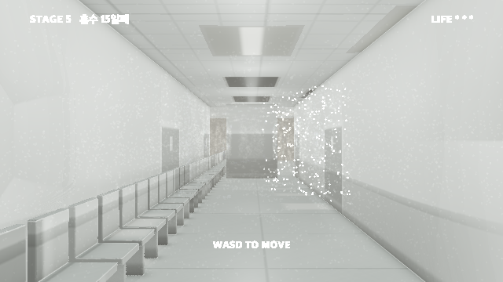 | 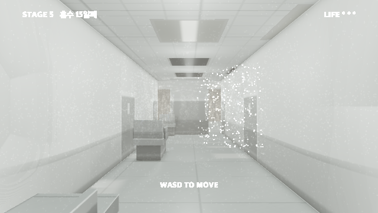 | 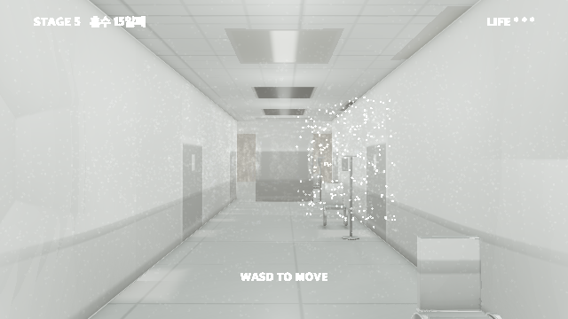 |

> **찍어보고 바뀐 판단:** 문서에서는 O-11 명패를 1순위로 꼽았는데, 실제로
> 그려보니 **O-1 의자 쪽이 훨씬 세다.** 복도 끝까지 이어지는 빈 의자 줄
> 하나가 지금까지 이 게임이 만든 이미지 중 가장 리미널하다.
>
> **주의:** 바닥에 서는 것들은 지금 **셰이더 필드에만** 들어 있어 **통과해서
> 걸어진다.** 채택 전에는 그게 맞는 거래다 — 아무도 안 고른 걸 두 거리장에
> 다 넣고 미로 검증까지 다시 돌리는 건 낭비니까. 채택하면 `cave_sdf`에도
> 넣고 `mazecheck`를 다시 돌린다. 복도의 의자는 **갇힐 수 있는 의자**다.

---

## 측정된 미로 상태

| 항목 | 값 |
|---|---|
| 직선 거리 | 300 m |
| 실제 최단 경로 | 405 m (12시드 평균) |
| 우회율 | 1.35× (1.17–1.50) |
| 현재 사물 수 | 0 |

미로 자체는 어렵지 않다. 어려운 건 방향 감각인데 랜드마크가 0이라 지도를
머릿속에 만들 수가 없다. **기괴한 사물은 그 자체로 랜드마크**이므로 위
시안들이 두 문제를 동시에 푼다.

---

## `-proto` 번호표

| N | 시안 |
|---|---|
| 0 | 출시 빌드 (기준선) |
| 1 | PL-1 천장의 문 |
| 2 | CT-1 문만 있는 벽 |
| 3 | CL-1 초록 병실 |
| 4 | CL-2 붉은 다도 |
| 5 | SC-1 자라난 문 |
| 6 | SC-3 소아병동 문 |
| 7 | PL-2 2 m 높이의 문 |
| 8 | CL-3 무너지는 구역 |
| 10 | O-11 명패 |
| 11 | O-9 · O-10 · O-14 벽 설비 |
| 12 | O-1 연결 대기 의자 |
| 13 | O-2 빈 병상 |
| 14 | O-4 링거대 · O-5 휠체어 |
| 15 | W-3 폐쇄병동 |
| 16 | W-4 수술부 |
| 17 | W-5 영안실 |
| 18 | W-1 소아병동 |
| 19 | W-10 기계실 |

---

## 추천

마감이 **9월 4일 23:39**이므로 값싼 것부터.

1. **O-1 연결 대기 의자** — 그림이 제일 세다. 단 두 거리장 + `mazecheck` 필요
2. **O-11 명패** — 길찾기가 같이 좋아지는 유일한 안. 벽에만 붙어 안전
3. **O-9 · O-10 · O-14** — 값싸고 복도에 리듬
4. **W-4 수술부** 또는 **W-5 영안실** — 마감만 바꿔 구역 하나가 완전히 달라진다
5. **LT-1 깜빡이는 등 하나** — 이미 있는 맥박 조명을 배신하는 방식이라 거의 공짜

병동은 **W-3 폐쇄병동** 하나만 골라도 주제가 크게 강해진다. 다만 위에 적었듯
지금 렌더는 약하니 벽 색과 관찰창을 손봐야 한다.
